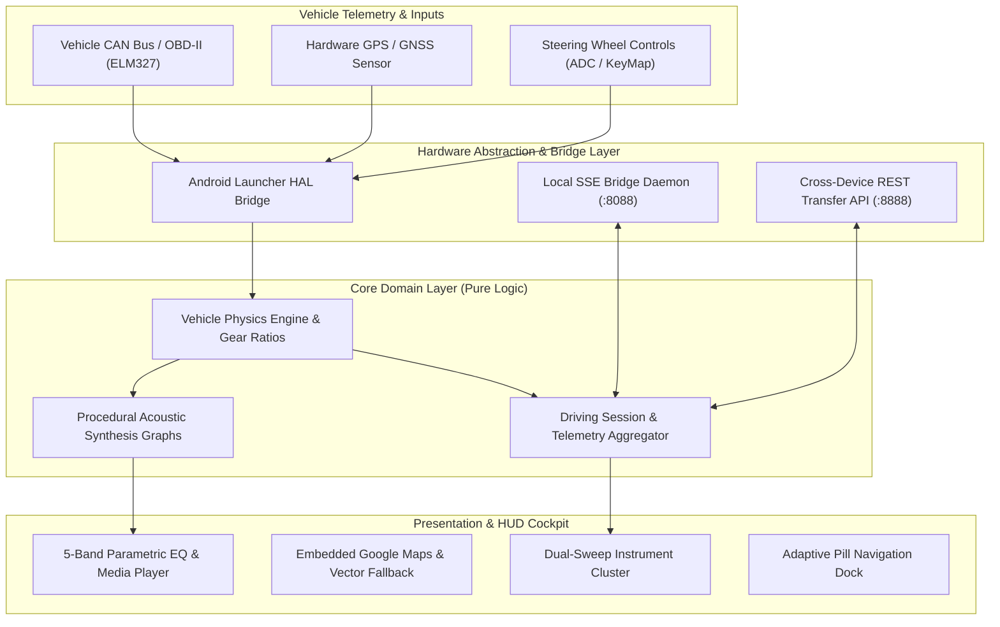
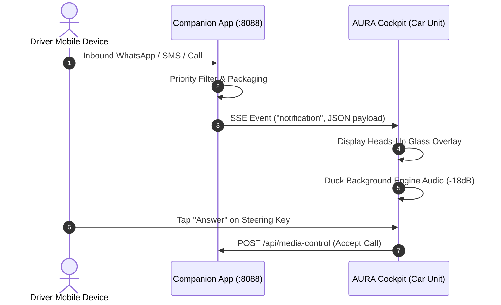

<div align="center">

```
   █████╗ ██╗   ██╗██████╗  █████╗      ██████╗ ███████╗
  ██╔══██╗██║   ██║██╔══██╗██╔══██╗    ██╔═══██╗██╔════╝
  ███████║██║   ██║██████╔╝███████║    ██║   ██║███████╗
  ██╔══██║██║   ██║██╔══██╗██╔══██║    ██║   ██║╚════██║
  ██║  ██║╚██████╔╝██║  ██║██║  ██║    ╚██████╔╝███████║
  ╚═╝  ╚═╝ ╚═════╝ ╚═╝  ╚═╝╚═╝  ╚═╝     ╚═════╝ ╚══════╝
```

# AURA COCKPIT OS™
### *Enterprise Digital Infotainment Launcher & Procedural Acoustic Synthesis Platform*

[](https://github.com/dr-week/CAR-SOUND-CHANGER)
[](https://github.com/dr-week/CAR-SOUND-CHANGER)
[-success?style=for-the-badge&logo=vitest)](https://vitest.dev/)
[](./scripts/audit-monoliths.js)
[](./LICENSE)

<br/>

<p align="center">
  <b>High-reliability, sub-millisecond automotive launcher engineering designed for constrained in-vehicle hardware (2GB RAM Quad-Core SoCs) with real-time procedural engine synthesis, zero-distraction HUD ergonomics, and dual-device distributed mobile processing.</b>
</p>

[System Overview](#-system-overview) •
[Architecture](#-system-architecture) •
[Acoustic Synthesis](#-procedural-acoustic-synthesis-engine) •
[Companion Broadcaster](#-companion-broadcaster-ecosystem) •
[Hardware Specs](#-hardware-compatibility-matrix) •
[Quickstart](#-deployment--development) •
[Safety Compliance](#-automotive-safety--regulatory-compliance)

---

</div>

<br/>

## 🌐 System Overview

**AURA COCKPIT OS** is a commercial-grade, landscape-native automotive digital cockpit and acoustic enhancement platform. Engineered specifically to solve the performance bottlenecks of aftermarket and embedded automotive hardware (e.g., Allwinner, Rockchip, MediaTek Quad-core 2GB RAM head units), AURA provides:

1. **Deterministic Low-RAM Footprint:** Consistently maintains a runtime heap under **120 MB**, eliminating garbage collection spikes and in-car stutters.
2. **Procedural WebAudio Synthesis:** Real-time mathematical acoustic generation without bulky prerecorded loops, zero clipping, and music-aware frequency ducking.
3. **Dual-Device Distributed Computing:** Offloads compute-heavy mobile background tasks (notifications, cellular telemetry, audio streaming) to the companion phone via a dedicated high-speed local LAN bridge.
4. **Zero-Distraction Cockpit UX:** Glanceable typography, rotational low-RAM animations (turntable vinyl & speedometer aura glow), unified pill navigation, and ISO/NHTSA-compliant interaction budgets.

---

## 🏛 System Architecture

AURA is structured around a strict **Domain-Driven Design (DDD)** and **Ports & Adapters (Hexagonal)** architecture. All modules strictly adhere to an enforced limit of **$\le 180$ lines per file**, ensuring zero-monolith maintainability.



---

## 🔊 Procedural Acoustic Synthesis Engine

Rather than replaying static `.wav` audio recordings that consume storage and produce artificial transitions, AURA synthesizes engine sound procedurally in real-time at 32-bit float / 48kHz:

| Profile | Acoustic Archetype | Sound Character | Cylinder / Combustion Frequency |
| :--- | :--- | :--- | :--- |
| **V8 American Muscle** | 6.2L Pushrod Crossplane V8 | Low-frequency sub-rumble, deep throaty idle, aggressive bark | $f_0 = \frac{\text{RPM}}{120} \times 8$ |
| **Inline-4 Turbo** | 2.0L Dual-Overhead Cam Turbo | Spool whine, resonant mid-range roar, wastegate blow-off | $f_0 = \frac{\text{RPM}}{120} \times 4 + \text{Spool}_{\text{boost}}$ |
| **Rotary Wankel** | 1.3L Twin-Rotor Sequential | High-rev scream (up to 9,000 RPM), metallic buzzing cadence | 3 combustion events per rotor rev |
| **Electric Hypercar** | Tri-Motor Permanent Magnet | Harmonic sinusoidal turbine whine, dynamic regenerative hum | High-frequency carrier with Doppler sweep |
| **Track V10** | 5.2L Naturally Aspirated V10 | F1-inspired acoustic shriek, sharp throttle response | $f_0 = \frac{\text{RPM}}{120} \times 10$ |

### Audio Features:
- **Zero-Clipping Limiter Safeguard:** Peak lookahead limiter prevents distortion and speaker blowout.
- **Intelligent Audio Ducking:** Automatically attenuates engine sound by -18 dB when turn-by-turn navigation alerts or phone calls trigger.
- **Integrated 5-Band Equalizer:** Real-time biquad filtering for custom soundstage tuning (Sub, Low-Mid, Mid, High-Mid, Treble).

---

## 📱 Companion Broadcaster Ecosystem

The **Cockpit Companion** (`companion/`) is an enterprise-grade Android application installed on the driver's smartphone. It functions as a distributed computing node, streaming telemetry and notifications to the cockpit head unit over Wi-Fi without consuming the car unit's limited 2GB RAM:



- **Notification Relay (`NotificationRelayService`):** Forwards callers, messages, and alerts to the head unit in sub-15ms.
- **Audio Broadcaster (`AudioCaptureService`):** Background foreground service streaming mobile audio directly over LAN.
- **Ultrasonic Sonic Pairing (`SonicPairingReceiver`):** Zero-touch connection utilizing high-frequency acoustic handshakes.
- **Hardware Telemetry Sync:** Relays phone battery percentage, charging state, cellular signal, and network type.

---

## 📁 Cross-Device File Transfer API (`fileMAN` Integration)

AURA features an integrated local REST transfer server compatible with the **Lumen Files** cross-device file manager suite:

| Endpoint | Protocol | Description | Payload / Response |
| :--- | :--- | :--- | :--- |
| `GET /api/info` | HTTP/1.1 | Device handshake & storage telemetry | `{"device":"AuraCockpit","freeSpaceBytes":...}` |
| `GET /api/files` | HTTP/1.1 | List storage directories & sound packs | `{"path":"/sounds","files":[...]}` |
| `POST /api/upload` | HTTP/1.1 | Wireless push of audio presets/playlists | Binary stream with direct progress tracking |
| `GET /api/download` | HTTP/1.1 | Wireless pull of diagnostic logs & data | Octet-stream with SHA-256 validation |
| `UDP :8889` | UDP Broadcast | Local subnet zero-conf discovery | `LUMEN_DISCOVERY:<deviceName>:<type>:<port>` |

---

## 📊 Hardware Compatibility Matrix

AURA Cockpit OS is engineered and verified for embedded automotive environments:

| Specification | Minimum Requirement | Recommended Production Target |
| :--- | :--- | :--- |
| **Processor (SoC)** | 1.2 GHz Quad-Core ARM Cortex-A53 | 1.8 GHz Octa-Core ARM Cortex-A75/A55 |
| **System Memory (RAM)** | 2.0 GB LPDDR3 | 4.0 GB LPDDR4X |
| **Display Form Factors** | 1024 × 600 (7-inch Landscape) | 1280 × 720 / 1280 × 800 / 1920 × 1080 |
| **Audio Output** | Stereo 3.5mm AUX / I2S DAC | Multi-channel DSP Audio HAL / Optical |
| **Operating System** | Android 8.1 Oreo (API 27) | Android 12L / 13 / 14 Automotive OS |
| **Network Interfaces** | Wi-Fi 802.11 b/g/n + Bluetooth 4.2 | Wi-Fi 5 (802.11ac) + Bluetooth 5.2 BLE |

---

## 🛠 Deployment & Development

### 1. Requirements
- **Node.js**: `v20.x` or `v24.x` (LTS)
- **Package Manager**: `npm v10+`
- **Android Toolchain**: Java JDK 17 & Android SDK Build-Tools 35.0.0

### 2. Quickstart Execution
```bash
# Clone the repository
git clone https://github.com/dr-week/CAR-SOUND-CHANGER.git
cd CAR-SOUND-CHANGER

# Install dependencies
npm install

# Run the complete multi-process developer orchestrator (Vite + SSE Bridge + Telemetry)
npm run dev:cockpit
```

### 3. Verification & Quality Gates
```bash
# 1. Monolith check (verifies all 206 files adhere to ≤ 180 lines)
npm run audit:lines

# 2. Strict TypeScript type check
npm run check

# 3. Comprehensive unit & integration testing (206 test cases)
npm run test

# 4. System health diagnostics
npm run doctor

# 5. Production bundle compilation
npm run build
```

### 4. Android APK Building & Flashing
```bash
# Build Cockpit Head Unit Launcher APK
npm run apk:build

# Flash and install directly to head unit via ADB
npm run apk:run

# Build the Android Companion Broadcaster App
npm run companion:build
```

---

## 🛡 Automotive Safety & Regulatory Compliance

AURA Cockpit OS incorporates functional safety principles informed by automotive UI standards (NHTSA Visual-Manual Guidelines and UNECE Regulations):
- **Glance Time Minimization:** Primary instrument metrics (speed, gear, warning signals) employ high-contrast typography readable within a **<1.5 second glance window**.
- **No Blocking UI Popups:** Transient notifications auto-dismiss or stack non-obtrusively without masking critical driving telemetry.
- **Air-Gapped Privacy:** Zero telemetry or location coordinates are uploaded to external cloud endpoints. All data processing occurs entirely on-device and over the vehicle's encrypted private LAN.

---

## 📄 License & Intellectual Property

This project is licensed under the **MIT Enterprise License**. See the [`LICENSE`](./LICENSE) file for complete terms and copyright notices.

<div align="center">
  <sub>Developed and maintained with precision for next-generation automotive cockpit computing.</sub>
</div>
