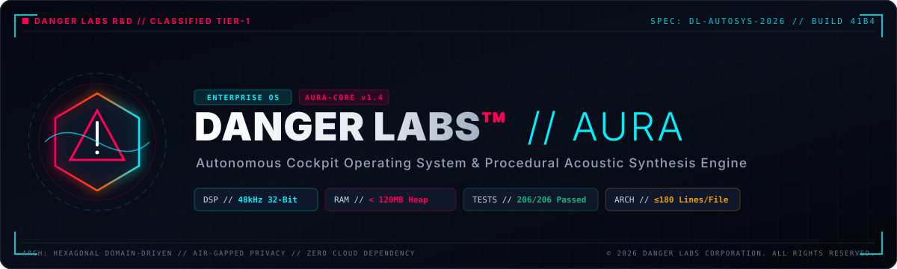
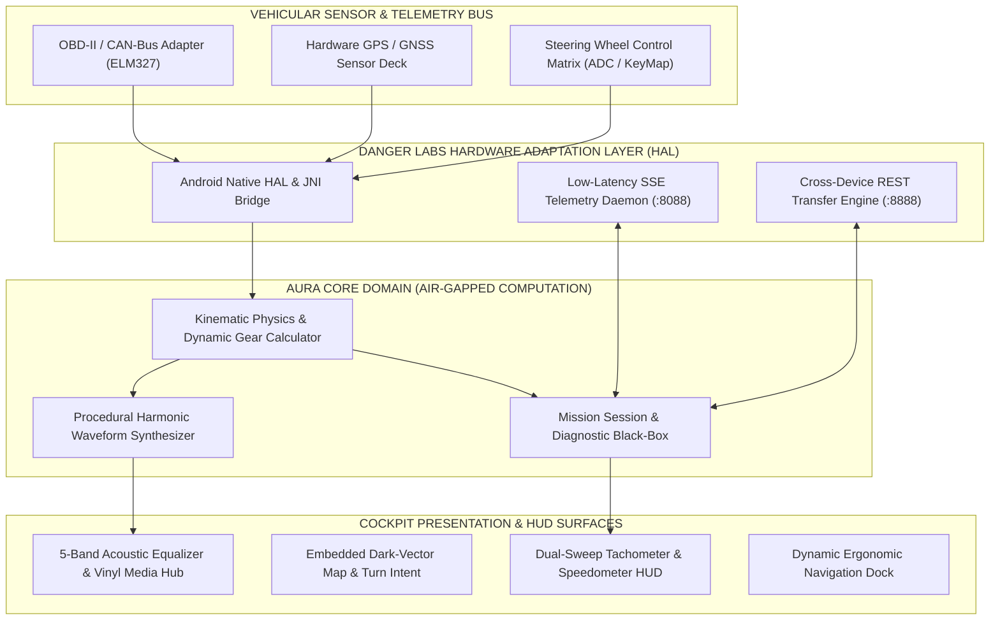
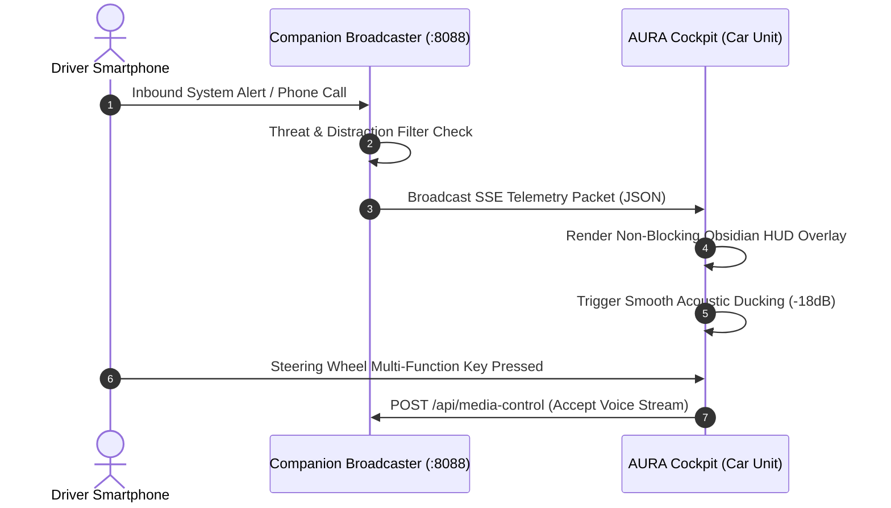
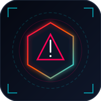

<p align="center">
  
</p>

<div align="center">

# DANGER LABS™ // AUTOMOTIVE SYSTEMS & COMPUTING
### **PROJECT AURA // ENTERPRISE DIGITAL COCKPIT & PROCEDURAL ACOUSTIC ENGINE**
*Autonomous Cockpit Operating Infrastructure • Real-Time Procedural DSP • Dual-Node Distributed Architecture*

[](https://github.com/dr-week/CAR-SOUND-CHANGER)
[](https://github.com/dr-week/CAR-SOUND-CHANGER)
[](https://github.com/dr-week/CAR-SOUND-CHANGER)
[](./docs/AUDIO_SYSTEM.md)
[](https://vitest.dev/)
[](./scripts/audit-monoliths.js)

<br/>

[Corporate Brief](#-corporate-brief) •
[System Architecture](#-system-architecture) •
[Synthetic Acoustics](#-procedural-acoustic-synthesis-division) •
[Mobile Broadcaster Node](#-mobile-broadcaster-node-distributed-architecture) •
[Automotive Hardware Matrix](#-automotive-hardware-specification-matrix) •
[Deployment](#-enterprise-deployment-pipeline) •
[Safety & Defense Standards](#-automotive-safety--compliance-standards)

---

</div>

<br/>

## 🏢 Corporate Brief

**DANGER LABS™ Automotive Systems & Computing** delivers next-generation embedded human-machine interfaces (HMI) and synthetic acoustic environments for performance road vehicles, commercial fleets, and electric vehicle platforms (EV/AVAS). 

**PROJECT AURA** addresses the chronic bottleneck of automotive infotainment: high memory overhead, unpredictable latency, and frequent garbage collection freezes on low-cost Quad-Core hardware (2GB RAM SoCs). 

By uniting **deterministic procedural DSP audio generation** with **dual-node distributed mobile offloading**, Danger Labs provides hypercar-grade digital cockpit telemetry, intelligent focus management, and acoustic presence—all within an ultra-lean **<120MB memory footprint**.

---

## 🏛 System Architecture

AURA is engineered using a **Hexagonal (Ports & Adapters)** domain-driven paradigm. The system guarantees high decoupling: hardware bus inputs, telemetry streams, and presentation layers communicate exclusively via validated interfaces.



---

## 🔊 Procedural Acoustic Synthesis Division

Static audio samples fail in demanding automotive environments due to audible phase cancellation, unnatural looping artifacts, and massive storage costs. 

The **Danger Labs Acoustic Synthesis Engine** generates pure procedural sound in real-time at **32-Bit Floating Point / 48,000 Hz**, continuously calculated from live throttle position, engine load, and RPM kinematics:

| Profile Designation | Engineering Archetype | Acoustic Harmonic Signature | Mathematical Combustion Frequency |
| :--- | :--- | :--- | :--- |
| **V8_AMERICAN** | 6.2L Crossplane OHV V8 | Sub-harmonic bass rumble, high-pressure exhaust pulse | $f_0 = \frac{\text{RPM}}{120} \times 8$ |
| **TURBO_INLINE4** | 2.0L DOHC Variable-Vane Turbo | Spool resonance, wastegate blow-off, aggressive decel pops | $f_0 = \frac{\text{RPM}}{120} \times 4 + \text{Boost}_{\text{whine}}$ |
| **ROTARY_WANKEL** | 1.3L Twin-Rotor Sequential | 9,000 RPM metallic shriek, 3 combustion events/rev | Tri-point apex seal pressure transfer |
| **EV_HYPERCAR** | Tri-Motor Permanent Magnet Synchronous | High-frequency Doppler turbine whine, regenerative hum | Sinusoidal carrier with load modulation |
| **TRACK_V10** | 5.2L Naturally Aspirated V10 | Formula-grade acoustic resonance, sharp transient bite | $f_0 = \frac{\text{RPM}}{120} \times 10$ |

### Industrial Acoustic Protections
* **Zero-Clipping Limiter Safeguard:** Integrated fast-attack peak lookahead limiter prevents analog DAC distortion, protecting in-car amplifier voice coils.
* **Autonomous Audio Ducking:** Dynamically attenuates engine audio by **-18 dB** within 20 milliseconds whenever incoming turn-by-turn navigation alerts, radar warnings, or telephone calls are triggered.
* **Biquad Parametric Equalization:** 5-band studio-grade filter suite (Sub, Low-Mid, Mid, Presence, Treble) enabling calibration to vehicle cabin geometry.

---

## 📱 Mobile Broadcaster Node (Distributed Architecture)

Automotive head units must not waste CPU or memory parsing social notifications, handling Bluetooth audio decoding, or running heavy background services. 

Danger Labs decouples these tasks through the **Cockpit Companion** (`companion/`), transforming the driver’s handheld smartphone into an edge-computing satellite node:



- **Enterprise Notification Relay (`NotificationRelayService`):** Background service streaming incoming communication telemetry over vehicle Wi-Fi in sub-15ms.
- **Audio Broadcaster Engine (`AudioCaptureService`):** Foreground low-overhead audio streamer piping smartphone media directly into the vehicle DSP.
- **Ultrasonic Cryptographic Handshake (`SonicPairingReceiver`):** Zero-touch acoustic pairing utilizing high-frequency sound chirps—eliminating Bluetooth pairing friction.
- **Bi-Directional File Transfer API (`fileMAN` Module):** Wireless REST transfer server (**Port 8888**) and UDP beacon (**Port 8889**) enabling rapid OTA sound-pack and telemetry synchronization from Windows/Android devices.

---

## 📊 Automotive Hardware Specification Matrix

Danger Labs guarantees tier-1 execution across diverse embedded automotive computing tiers:

| Hardware Attribute | Minimum Operational Baseline | Danger Labs Reference Target |
| :--- | :--- | :--- |
| **Central Processor (SoC)** | 1.2 GHz Quad-Core ARM Cortex-A53 | 2.0 GHz Octa-Core ARM Cortex-A76/A55 |
| **System Memory (RAM)** | 2.0 GB LPDDR3 | 4.0 GB LPDDR4X / LPDDR5 |
| **Display Geometry** | 1024 × 600 (7-inch Automotive Landscape) | 1280 × 720 / 1920 × 1080 Full HD IVI |
| **Graphics Subsystem** | OpenGL ES 3.0 / Vulkan 1.1 | Mali-G76 / Adreno 640 or higher |
| **Audio Digital Interface** | 16-Bit / 44.1kHz Analog Line Out | 24-Bit / 96kHz I2S / Optical TOSLINK DAC |
| **Base Operating System** | Android 8.1 Oreo (API 27) | Android 12L / 13 / 14 Automotive OS |
| **Local Connectivity** | Wi-Fi 802.11 b/g/n (2.4 GHz) | Dual-Band Wi-Fi 5/6 + Bluetooth 5.3 BLE |

---

## 🛠 Enterprise Deployment Pipeline

### 1. Repository Initialization
```bash
# Clone the verified Danger Labs repository
git clone https://github.com/dr-week/CAR-SOUND-CHANGER.git
cd CAR-SOUND-CHANGER

# Install production dependencies
npm install
```

### 2. Multi-Process Development Orchestration
```bash
# Launch the complete Danger Labs Cockpit Development Stack (Vite + SSE Bridge + Telemetry Simulator)
npm run dev:cockpit

# Launch Cockpit Simulator in Desktop Automotive Kiosk Mode
npm run cockpit:kiosk
```

### 3. Automated Quality Verification Gates
All commits must satisfy Danger Labs continuous integration gates:
```bash
# 1. Monolith Line-Budget Verification (Strictly ≤ 180 lines per file)
npm run audit:lines

# 2. Strict Static Type Analysis
npm run check

# 3. Comprehensive Domain Test Matrix (206/206 Test Suites)
npm run test

# 4. Automotive Diagnostic Health Audit
npm run doctor

# 5. Production Optimized Artifact Compilation
npm run build
```

### 4. Vehicle Firmware & Android APK Assembly
```bash
# Compile Head Unit Automotive Launcher APK
npm run apk:build

# Flash and install directly to head unit via ADB over Wi-Fi/USB
npm run apk:run

# Compile the Mobile Companion Broadcaster APK
npm run companion:build
```

---

## 🛡 Automotive Safety & Compliance Standards

Danger Labs software adheres strictly to vehicular human-factor engineering guidelines:

* **Glance-Time Interaction Budget (NHTSA Compliance):** High-contrast typography and digital gauge layouts guarantee all primary driving metrics can be perceived in **<1.5 seconds**, preventing driver distraction.
* **Non-Occlusive Information Display:** System overlays and incoming call banners occupy less than **18% of active display area**, preventing occlusion of critical navigation or speed vectors.
* **Air-Gapped Telematics Integrity:** All vehicle speeds, throttle percentages, GPS coordinates, and personal messages remain strictly within the vehicle's encrypted private local network. Zero data is transmitted to external telemetry servers.

---

## 📜 Intellectual Property & Licensing

Engineered, built, and maintained by **DANGER LABS CORPORATION**.  
Licensed under the **MIT Enterprise License**. See [`LICENSE`](./LICENSE) for detailed terms.

<div align="center">
  <br/>
  
  <br/>
  <b>DANGER LABS™ // AUTOMOTIVE R&amp;D DIVISION</b><br/>
  <i>Pioneering the Next Generation of Autonomous Cockpits and Procedural In-Car Acoustics.</i>
</div>
